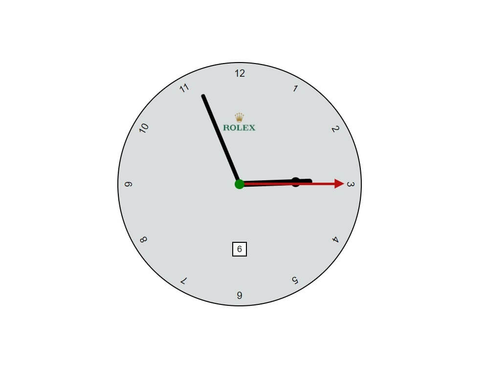

# clockJs
> Awesome Rolex clock app.
>[DEMO](https://tomekxoxo.github.io/clockJs/)

## Table of contents
* [General info](#general-info)
* [Screenshots](#screenshots)
* [Technologies](#technologies)
* [Setup](#setup)
* [Status](#status)
* [Contact](#contact)

## General info
Clock created with HTML5 CSS /SCSS, javaScript.

## Screenshots

## Technologies
* HTML5
* CSS/ SCSS
* JAVASCRIPT

## Setup
Simply download files and open in live server.
If you want to develope please use `npm install` and use scripts saved in package.json.

## Status
Project is: finished.

## Contact
Created by tomekxoxo: <tomaszkasprowicz24@gmail.com> - feel free to contact me!

